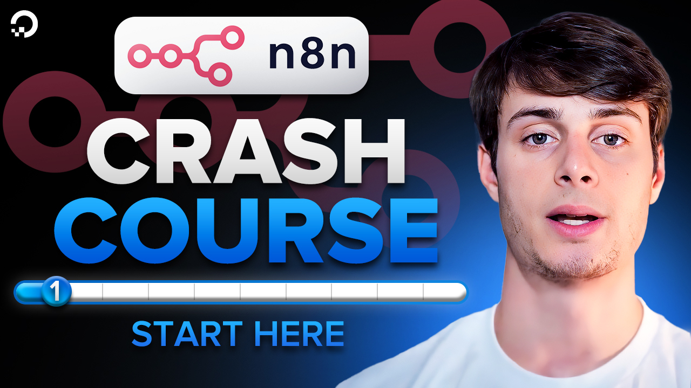
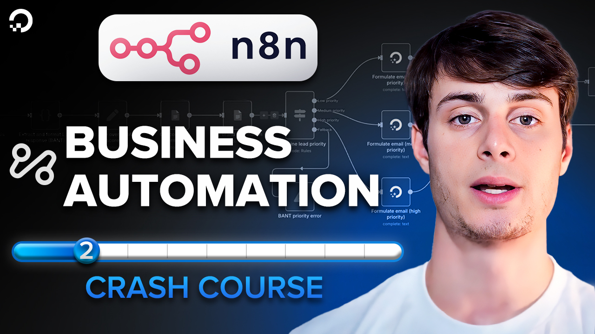
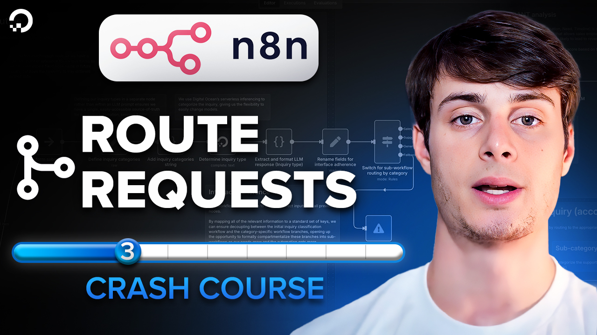
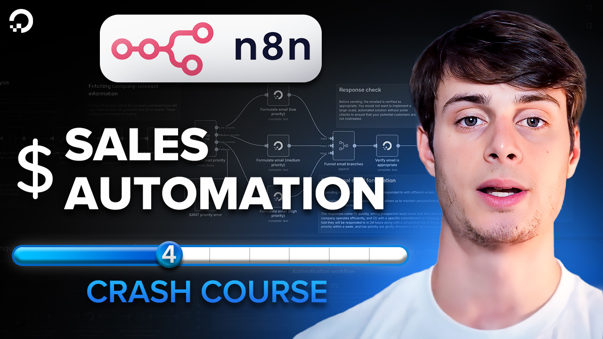

# n8n-crash-course
A complete n8n crash course - learn LLMs, databases, authentication, and more

# Lesson 1 - Course introduction
Get quickly introduced to the course so you can know what to expect.

Watch it on YouTube:

# Lesson 2 - Project overview
Get an overview of the project we'll be building in the course.

Watch it on YouTube:

# [Lesson 3 - Automatic request routing in n8n](./lessons/lesson_3/README.md)

Learn how to automatically route requests to different execution branches in n8n in [Lesson 3](./lessons/lesson_3/README.md)

Watch it on YouTube:

# [Lesson 4 - Build an AI sales assistant in n8n](./lessons/lesson_4/README.md)

Learn how to build a sales assistant that can automatically respond to and stack-rank leads in [Lesson 4](./lessons/lesson_4/README.md)

Watch it on YouTube:

# [Lesson 5 - Build an AI RAG agent in n8n (Gradient AI method)](./lessons/lesson_5/README.md)

Learn how to quickly build an AI RAG agent that can automatically respond to product questions [Lesson 5](./lessons/lesson_4/README.md).

Watch it on YouTube:

