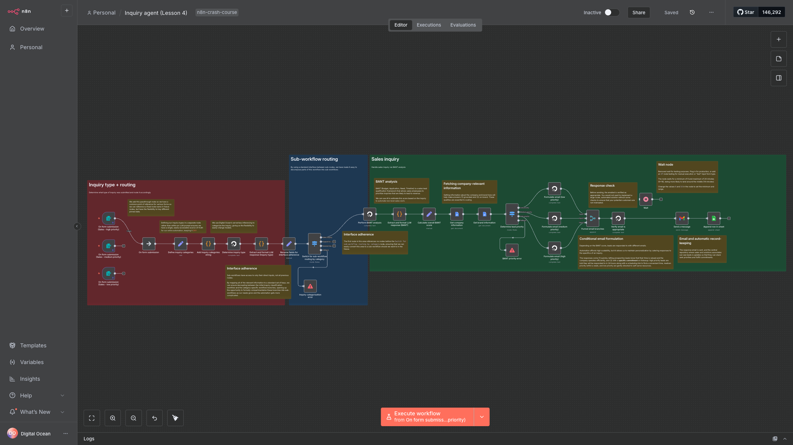
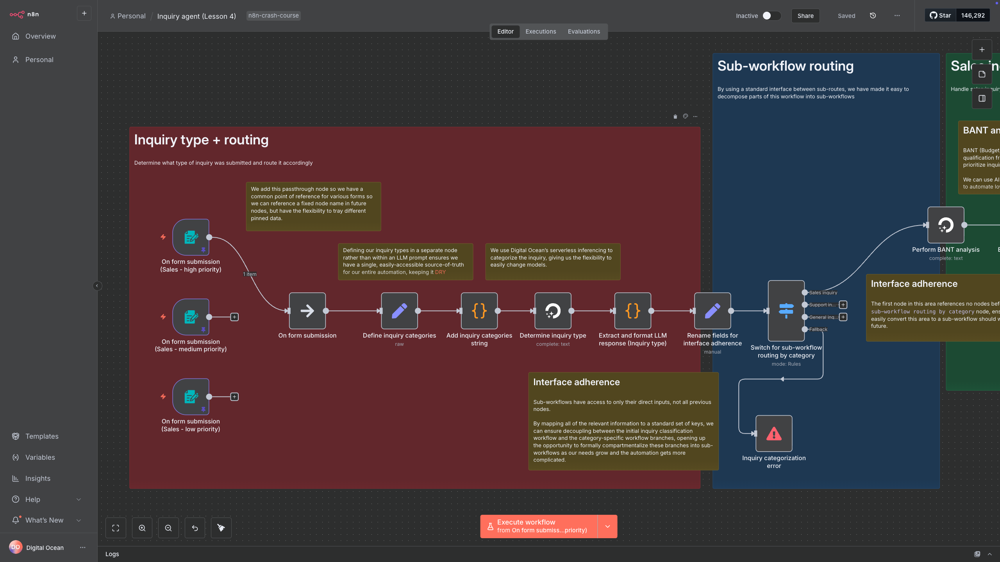
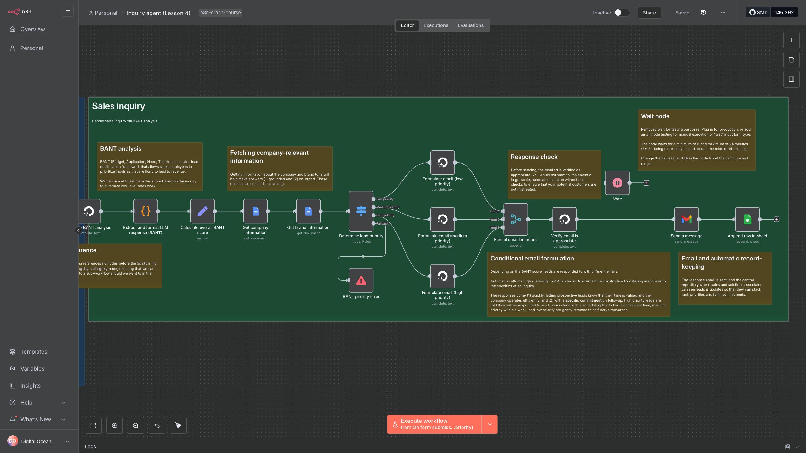

# Lesson 4 - Build an AI sales assistant with n8n

Watch it on YouTube:

---

Learn how to build an automated AI sales assistant with n8n

In [Lesson 3](../lesson_3/README.md) we learned how to automatically route requests from a contact form in n8n:

In Lesson 4, we build an AI sales assistant to handle sales requests. In particular, we learn how to:

1. Use an LLM to before BANT (Budget, Authority, Need, Timeline) analysis and bucket leads based on priority
1. Create a Google Cloud Project with credentials, and add them to n8n
1. Load documents from Google Docs to ground LLM inference
1. Automatically formulate and send personalized emails with different commitments to leads, based on priority level
1. Automatically update reporting spreadsheets
1. Add random wait times with curated distributions

