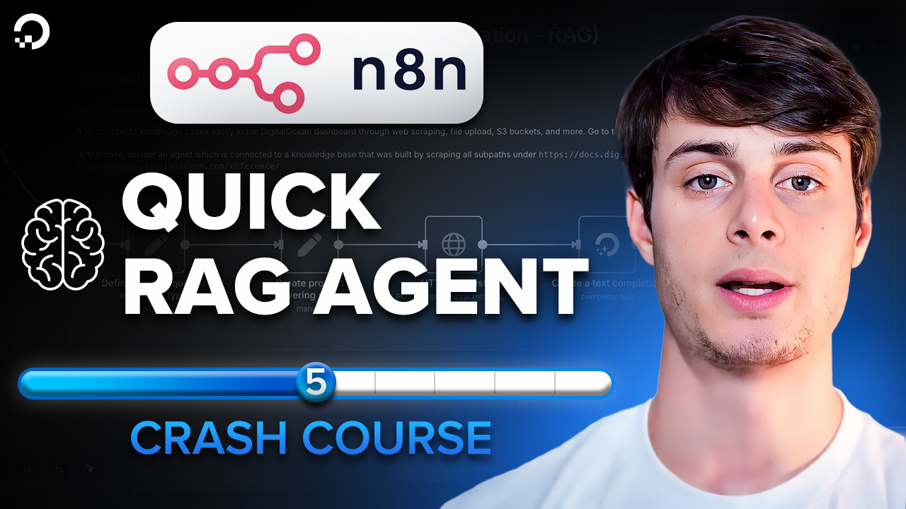
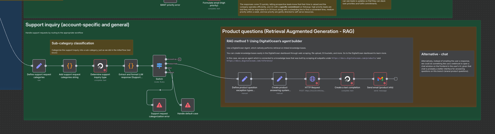

# Lesson 5 - Build an AI RAG agent in n8n (Gradient AI method)

Watch it on YouTube:

---

Learn how to build an AI RAG agent and add it to n8n using Gradient AI

In [Lesson 4](../lesson_4/README.md) we learned how to build an AI sales assistant in n8n that can handle sales inquiries.

In Lesson 5, we build an AI sales assistant to handle **product questions**. In particular, we learn how to:

1. Use Gradient AI to create an AI agent
1. Easily build a knowledge base by scraping a our documentation
1. Connect the Gradient AI agent to n8n to answer product questions automatically

