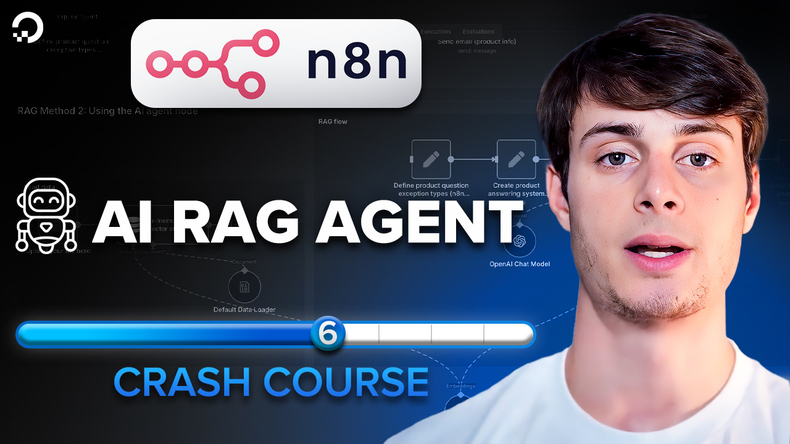

# Lesson 6 - n8n AI RAG explained (built-in n8n method)

Watch it on YouTube:

---

In [Lesson 5](../lesson_4/README.md) we learned how to rapidly build AI RAG agents with Gradient AI and connect them to n8n workflows.

In Lesson 6, we learn how to do this using **n8n's built in nodes**, learning what all of the components of such an AI agent do and how they fit together.
