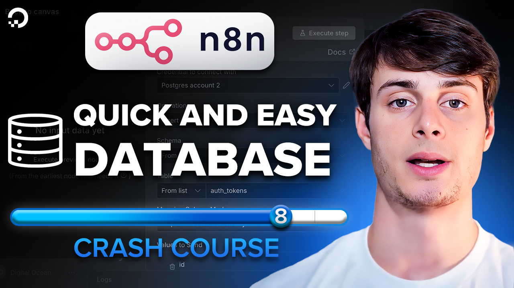

# Lesson 8 - Add a database to n8n

Watch it on YouTube:

In [Lesson 7](../lesson_7/README.md), we learned how to create magic link tokens that we'll use for authentication. In Lesson 8, we spin up the database we'll use to store them and connect it to n8n (learning how to avoid certificate errors along the way).
