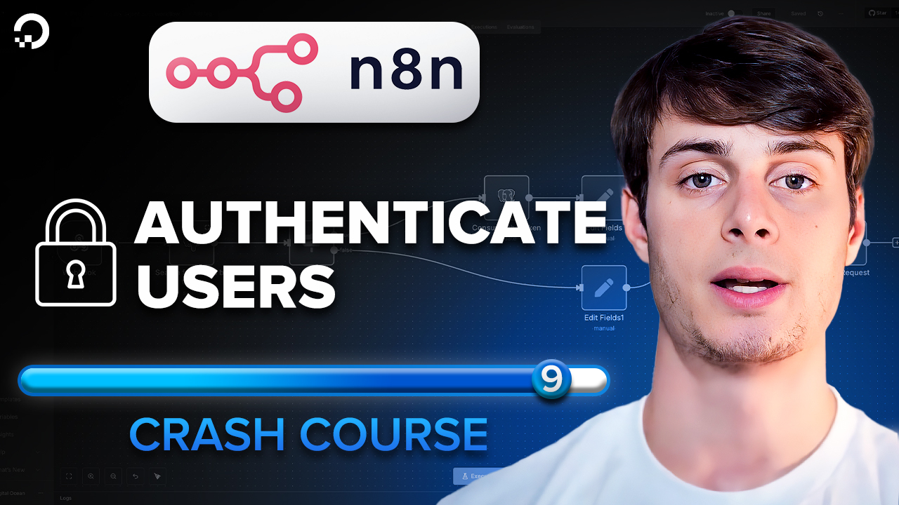

# Lesson 8 - Build n8n authentication workflow

Watch it on YouTube:

In [Lesson 8](../lesson_8/README.md), we learned how to add a database to n8n to store auth tokens. In this lesson, we finish off the course by building the authentication workflow and connecting it to our main workflow.
